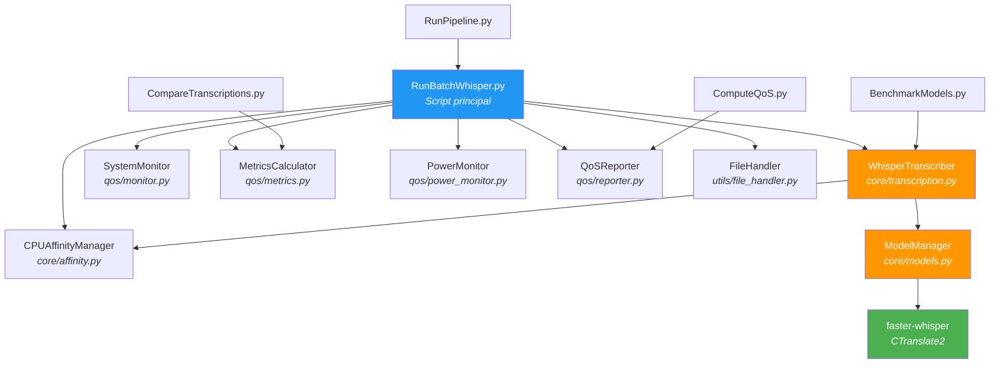
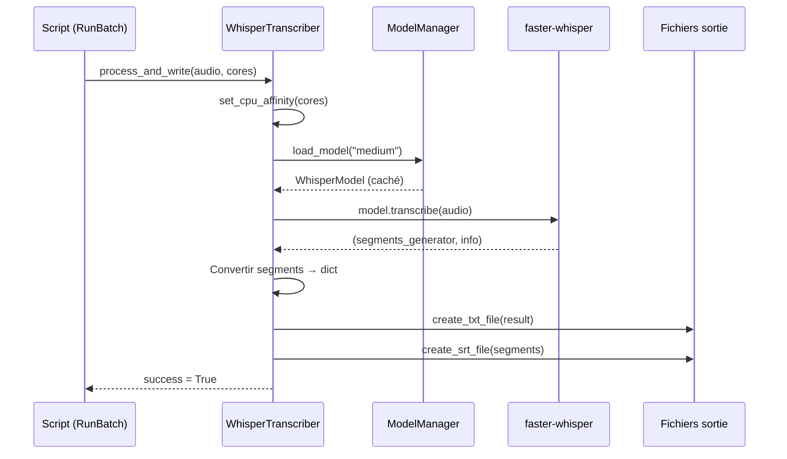
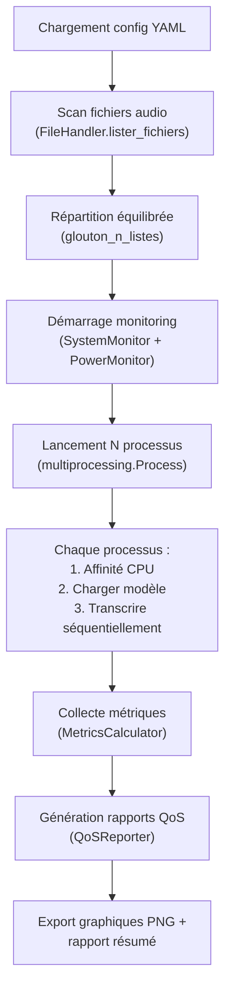
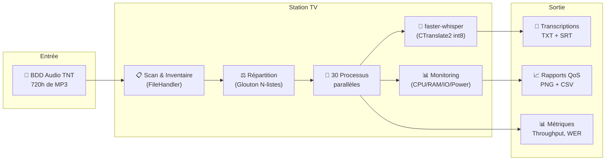

# Station TV — Rapport de Projet

## 1. Présentation Générale

### 1.1 Contexte et Objectifs

**Station TV** est un système de transcription automatique d'enregistrements audio issus de la TNT française. Le projet vise à convertir massivement des fichiers audio (MP3, WAV) en texte à l'aide du modèle de reconnaissance vocale **Whisper** (d'OpenAI), tout en maximisant les performances grâce à un traitement parallèle multi-processus.

Le système est conçu pour fonctionner sur un serveur **Dell Precision 5820** équipé de :
- **CPU** : Intel Xeon W-2295 (18 cœurs physiques, 36 threads)
- **RAM** : 256 Go DDR4
- **OS** : Windows (chemins configurés en conséquence)

### 1.2 Objectifs Principaux

| Objectif | Description |
|---|---|
| **Transcription massive** | Transcrire ~720 heures d'audio (24 fichiers × 1h × 30 processus) en quelques heures |
| **Haute performance** | Exploitation de 30 processus parallèles avec affinité CPU par cœur |
| **Supervision complète** | Monitoring temps réel du CPU, RAM, I/O disque et consommation énergétique |
| **Qualité contrôlée** | Métriques QoS (throughput, WER, taux de réussite, temps de traitement) |
| **Formats multiples** | Sortie en TXT (texte brut), SRT (sous-titres horodatés), CSV et JSON |

### 1.3 Moteur de Transcription

Le projet utilise **faster-whisper**, une implémentation optimisée de Whisper basée sur **CTranslate2** au lieu de PyTorch. Ce choix permet :
- **~3-4× plus rapide** que openai-whisper (PyTorch)
- **~70-80% de RAM en moins** par processus (quantification int8)
- Qualité de transcription quasi-identique

---

## 2. Architecture du Projet

### 2.1 Vue d'Ensemble

```
stationtv/
├── core/                    # Modules métier principaux
│   ├── models.py            # Gestion des modèles Whisper (chargement, cache, RAM)
│   ├── transcription.py     # Moteur de transcription (faster-whisper)
│   └── affinity.py          # Affinité CPU et répartition de charge
│
├── qos/                     # Supervision et qualité de service
│   ├── monitor.py           # Monitoring temps réel (CPU, RAM, I/O)
│   ├── metrics.py           # Calcul des métriques (throughput, WER, succès)
│   ├── power_monitor.py     # Monitoring énergétique (RAPL / estimation)
│   └── reporter.py          # Génération de graphiques et rapports PNG
│
├── preprocessing/           # Prétraitement audio
│   └── audio_converter.py   # Conversion MP3 → WAV via FFmpeg
│
├── export/                  # Export des résultats
│   └── exporter.py          # Export JSON, CSV et backup
│
├── utils/                   # Utilitaires transversaux
│   ├── file_handler.py      # Scan récursif de fichiers, métadonnées audio
│   └── logger.py            # Système de logging centralisé
│
├── scripts/                 # Points d'entrée exécutables
│   ├── RunBatchWhisper.py   # Script principal: transcription batch multi-process
│   ├── RunPipeline.py       # Pipeline automatique complet (scan → transcription → QoS)
│   ├── BenchmarkModels.py   # Benchmark comparatif des modèles (tiny → large)
│   ├── BasicTestWhisper.py  # Test rapide de transcription sur un fichier
│   ├── ComputeQoS.py        # Génération post-traitement des rapports QoS
│   ├── CompareTranscriptions.py  # Comparaison Small vs Medium (WER + diff HTML)
│   ├── GenerateExcelReport.py    # Rapport Excel formaté avec graphiques
│   ├── PrepareTestFiles.py       # Préparation des fichiers de test
│   ├── CheckBenchmarkSetup.py    # Vérification de l'environnement benchmark
│   └── RunTests.py               # Lanceur de tests unitaires
│
├── tests/                   # Tests unitaires
│   └── test_core.py         # Tests ModelManager, CPUAffinity, Metrics, FileHandler
│
├── config/                  # Configuration
│   ├── default_config.yaml  # Configuration principale (matériel, Whisper, QoS, paths)
│   ├── benchmark_config.yaml # Configuration spécifique aux benchmarks
│   └── MONITORING_CONFIG.md  # Documentation de la configuration monitoring
│
├── docs/                    # Documentation
│   ├── BENCHMARK_GUIDE.md
│   ├── BENCHMARK_QUICKSTART.md
│   ├── POWER_MONITORING.md
│   └── STVD_NAMING_CONVENTION.md
│
├── diagrams/                # Diagrammes UML (PlantUML)
│   ├── class_diagram.puml
│   ├── sequence_batch_transcription.puml
│   └── sequence_simple_transcription.puml
│
├── requirements.txt         # Dépendances Python
├── RUN_PIPELINE.bat         # Lanceur Windows
├── README.md
├── QUICKSTART.md
└── SPECIFICATIONS_TECHNIQUES.md
```

### 2.2 Diagramme de Dépendances



---

## 3. Modules en Détail

### 3.1 Core — `core/`

#### 3.1.1 `models.py` — ModelManager

Gestionnaire centralisé des modèles Whisper utilisant **faster-whisper** (CTranslate2).

**Responsabilités :**
- Chargement et mise en cache des modèles (`WhisperModel`)
- Validation de la disponibilité mémoire avant lancement
- Estimation de la RAM nécessaire par configuration

**Modèles supportés :**

| Modèle | RAM estimée (int8) | Suffixe fichier | Qualité |
|---|---|---|---|
| `tiny` | 0.5 Go | `wt` | Basique |
| `base` | 0.5 Go | `wb` | Acceptable |
| `small` | 1 Go | `ws` | Bonne |
| `medium` | 3 Go | `wm` | Très bonne |
| `large` / `large-v2` / `large-v3` | 5 Go | `wl` / `wl2` / `wl3` | Excellente |

**Paramètres clés :**
- `device` : `cpu` ou `cuda` (CPU par défaut pour stabilité)
- `compute_type` : `int8` (quantification optimale pour CPU), `float16`, `float32`

**API principale :**
```python
manager = ModelManager(device="cpu", compute_type="int8")
model = manager.load_model("medium")          # Charge et met en cache
ram = manager.estimate_ram_usage("medium", 30) # Estime RAM pour 30 processus
manager.validate_memory_availability("medium", 30, total_ram_gb=256)
```

---

#### 3.1.2 `transcription.py` — WhisperTranscriber

Moteur de transcription principal. Orchestre le chargement du modèle, l'exécution de la transcription et l'écriture des fichiers de sortie.

**Responsabilités :**
- Transcription audio → texte via faster-whisper
- Définition de l'affinité CPU par processus
- Génération des fichiers TXT et SRT
- Conversion du résultat faster-whisper (générateur) en dict compatible

**Flux de transcription :**



**Format de sortie normalisé :**
```python
result = {
    "text": "Transcription complète...",
    "segments": [
        {"id": 0, "start": 0.0, "end": 2.5, "text": "Bonjour", "words": [...]},
        ...
    ],
    "language": "fr",
    "duration": 3600.0
}
```

**Convention de nommage des fichiers (STVD-MNER) :**
- TXT : `{timestamp}_transcript_{model_suffix}.txt`
- SRT : `{timestamp}_transcript_st_{model_suffix}.srt`

---

#### 3.1.3 `affinity.py` — CPUAffinityManager

Gestion de l'affinité CPU et répartition équilibrée de la charge audio entre processus.

**Responsabilités :**
- Épinglage des processus sur des cœurs CPU spécifiques via `psutil`
- Algorithme glouton pour répartir N fichiers audio sur K processus de manière équilibrée

**Algorithme glouton (`glouton_n_listes`) :**
1. Trier les fichiers audio par durée décroissante
2. Pour chaque fichier, l'affecter au processus ayant la charge totale la plus faible
3. Résultat : des listes de durées quasi-égales → temps de fin homogène entre processus

```python
audios = [Audio("f1.mp3", 3600), Audio("f2.mp3", 1800), ...]
listes = CPUAffinityManager.glouton_n_listes(audios, n=30)
# → 30 listes équilibrées
```

---

### 3.2 QoS — `qos/`

#### 3.2.1 `monitor.py` — SystemMonitor

Monitoring système temps réel avec threads en arrière-plan. Enregistre les données dans des fichiers CSV.

**Métriques surveillées :**

| Métrique | Fichier CSV | Colonnes |
|---|---|---|
| CPU | `monitoring_cpu.csv` | Timestamp, CPU_Usage_Percent |
| RAM | `monitoring_memory.csv` | Timestamp, Memory_Percent, Memory_Used_GB, Memory_Total_GB |
| I/O disque | `monitoring_io.csv` | Timestamp, IO_Usage_Percent, Read_MB_s, Write_MB_s, Read_IOPS, Write_IOPS |

**Usage :**
```python
monitor = SystemMonitor(output_dir="reports", interval=10)
monitor.start()    # Lance 3 threads daemon (CPU, RAM, I/O)
# ... transcription en cours ...
monitor.stop()     # Arrête et joint les threads
```

Supporte le context manager (`with SystemMonitor(...) as m:`).

---

#### 3.2.2 `metrics.py` — MetricsCalculator

Calcul des métriques de qualité de service de la transcription.

**Métriques calculées :**

| Métrique | Description | Formule |
|---|---|---|
| **Throughput** | Débit de transcription | `durée_audio_totale / temps_réel_total` |
| **Taux de réussite** | % de transcriptions réussies | `succès / total` |
| **Temps moyen** | Temps de traitement par fichier | `Σ temps / N` |
| **WER** | Word Error Rate (distance d'édition) | `(Sub + Ins + Del) / Nombre_mots_ref` |

Le WER est implémenté via l'algorithme de **Levenshtein** (programmation dynamique) :
- Substitutions, insertions et suppressions de mots
- Score de 0.0 (parfait) à 1.0+ (complètement faux)

---

#### 3.2.3 `power_monitor.py` — PowerMonitor

Monitoring de la consommation énergétique du serveur.

**Méthodes de mesure :**
1. **Intel RAPL** (si disponible via `pyRAPL`) : lecture directe des registres MSR du processeur
2. **Estimation CPU** (fallback) : `puissance = TDP × (utilisation_CPU / 100)`

**Métriques calculées :**
- Puissance instantanée (Watts)
- Énergie totale consommée (kWh)
- Coût financier estimé (€, basé sur 0.18 €/kWh — moyenne France)
- Émissions CO₂ estimées (kg, basé sur 0.1 kg CO₂/kWh — mix France)

---

#### 3.2.4 `reporter.py` — QoSReporter

Génération de graphiques et rapports visuels à partir des fichiers CSV de monitoring.

**Graphiques générés :**

| Graphique | Fichier PNG | Contenu |
|---|---|---|
| CPU | `cpu_usage.png` | Courbe d'utilisation CPU (%) avec moyenne |
| RAM | `memory_usage.png` | 2 subplots : % utilisation + Go utilisés/totaux |
| Énergie | `power_usage.png` | Puissance (W) et énergie cumulative (Wh) |
| I/O | `io_usage.png` | 2 subplots : % occupation disque + débit R/W (MB/s) |

Utilise `matplotlib` + `seaborn` pour un rendu professionnel.

---

### 3.3 Preprocessing — `preprocessing/`

#### `audio_converter.py` — AudioConverter

Conversion de fichiers audio via **FFmpeg**.

**Configuration par défaut :**
- Format cible : WAV
- Fréquence : 48 000 Hz
- Canaux : 1 (mono)
- Profondeur : 16 bits (PCM16)

Supporte la conversion unitaire (`convert_to_wav`) et par lot (`convert_batch`).

---

### 3.4 Export — `export/`

#### `exporter.py` — TranscriptionExporter

Export des résultats de transcription dans des formats structurés.

**Formats d'export :**
- **JSON** : structure complète avec métadonnées (version, timestamp, segments horodatés)
- **CSV** : tableau tabulaire avec chemin, durée, texte, nombre de segments, métadonnées (chaîne, date, émission)
- **Backup** : copie ou archive ZIP des transcriptions avec timestamp

---

### 3.5 Utils — `utils/`

#### `file_handler.py` — FileHandler

Scan récursif de fichiers audio dans une arborescence de répertoires.

**Fonctionnalités :**
- `lister_fichiers(chemin, suffixes)` : parcours récursif (pile), filtre par extension, extrait la durée via `mutagen`
- `ecrire_csv(objets, fichier)` : export de l'inventaire (chemin, durée) en CSV
- `lire_csv(fichier)` : lecture d'un inventaire CSV existant
- Filtrage automatique des fichiers sans piste audio détectable (durée = 0)

#### `logger.py`

Système de logging centralisé avec formatage standardisé (`asctime - name - level - message`). Supporte la sortie console et fichier simultanée.

---

## 4. Scripts Principaux

### 4.1 `RunBatchWhisper.py` — Transcription Batch

**Script principal du projet.** Lance la transcription massive multi-processus.

**Flux d'exécution :**



**Commande :**
```bash
python scripts/RunBatchWhisper.py --config config/default_config.yaml
```

**Options :**
- `--config` : fichier de configuration YAML
- `--scan-only` : scanner les fichiers sans lancer la transcription

---

### 4.2 `BenchmarkModels.py` — Benchmark Comparatif

Évalue les performances de chaque modèle Whisper (tiny → large) sur plusieurs fichiers audio avec N répétitions.

**Métriques par test :**
- Temps moyen, médian, min, max, écart-type
- RT factor (Real-Time) : rapport `durée_audio / temps_traitement`
- Matrice croisée `durée × modèle` exportée en CSV

**Commande :**
```bash
python scripts/BenchmarkModels.py --config config/benchmark_config.yaml --models tiny base small medium --repetitions 5
```

---

### 4.3 `RunPipeline.py` — Pipeline Automatique

Orchestrateur qui enchaîne toutes les étapes :

| Étape | Description |
|---|---|
| 1. Scan | Inventaire des fichiers audio |
| 2. Transcription | Lancement de `RunBatchWhisper` |
| 3. Rapports QoS | Génération des graphiques via `ComputeQoS` |
| 4. Tests | Exécution des tests unitaires (optionnel) |

---

### 4.4 `CompareTranscriptions.py` — Comparaison de Qualité

Compare deux transcriptions (ex: Small vs Medium) et produit :
- **WER relatif** : différence en pourcentage
- **Analyse mot à mot** : substitutions, insertions, suppressions (via `difflib.SequenceMatcher`)
- **Rapport HTML** : visualisation colorée des différences
- **Rapport texte** : résumé avec exemples d'écarts

---

### 4.5 `GenerateExcelReport.py` — Rapport Excel

Convertit les résultats CSV des benchmarks en fichier Excel formaté avec :
- Feuille de données brutes
- Matrice pivot croisée (durée × modèle)
- Graphiques intégrés (barres par modèle, lignes par durée)

---

### 4.6 `ComputeQoS.py` — Post-Traitement QoS

Génère les graphiques de monitoring à partir des CSV produits pendant la transcription. Utile pour régénérer les graphiques sans relancer la transcription.

```bash
python scripts/ComputeQoS.py --session-dir output/reports
```

---

## 5. Configuration

Le fichier `config/default_config.yaml` centralise toute la configuration du système, organisée en sections :

| Section | Paramètres clés |
|---|---|
| `hardware` | Nombre de cœurs (24), threads (36), processus max (30), RAM totale (256 Go) |
| `whisper` | Modèle (`medium`), langue (`fr`), device (`cpu`), `compute_type` (`int8`), affinité CPU par processus, formats de sortie |
| `preprocessing` | Format WAV, 48 kHz, mono, PCM16, segmentation |
| `qos` | Intervalle monitoring (10s), seuils d'alerte CPU/RAM, monitoring énergétique, coût €/kWh |
| `export` | Encodage UTF-8, métadonnées JSON, backup automatique |
| `paths` | Répertoires d'entrée (BDD audio), sortie, logs, trackers, backup |
| `logging` | Niveau INFO, rotation 100 Mo, 5 backups |
| `batch` | Taille batch (24), retries (3), tri par durée |

---

## 6. Dépendances

Fichier `requirements.txt` :

| Catégorie | Packages |
|---|---|
| **IA / Transcription** | `faster-whisper` (CTranslate2) |
| **Audio** | `ffmpeg-python`, `librosa`, `mutagen`, `pydub` |
| **Data** | `numpy`, `pandas` |
| **Monitoring** | `psutil` |
| **Visualisation** | `matplotlib`, `seaborn` |
| **Configuration** | `PyYAML` |
| **Tests** | `pytest`, `pytest-cov` |
| **Utilitaires** | `tqdm`, `python-dateutil` |

---

## 7. Tests

### 7.1 Tests Unitaires (`tests/test_core.py`)

11 tests couvrant les modules principaux :

| Classe de test | Tests | Ce qui est vérifié |
|---|---|---|
| `TestModelManager` | 4 | Spécifications modèles, suffixes, estimation RAM (int8), validation mémoire |
| `TestCPUAffinityManager` | 3 | Algorithme glouton (basique, équilibrage, liste vide) |
| `TestMetricsCalculator` | 3 | Throughput, taux de réussite, WER (identique + différent) |
| `TestFichierAudio` | 1 | Création d'objet avec extraction de durée |

**Commande :**
```bash
python3 tests/test_core.py
# ou
python3 -m pytest tests/test_core.py -v
```

---

## 8. Flux de Fonctionnement Global



---

## 9. Performances Attendues

### Configuration actuelle (30 processus, modèle medium, int8)

| Métrique | Valeur estimée |
|---|---|
| **RAM totale** | ~20-30 Go (avec faster-whisper int8) |
| **Throughput global** | ~120-150× temps réel |
| **Temps pour 720h d'audio** | ~5-6 heures |
| **Consommation CPU** | ~83% utilisation moyenne |

### Comparaison avec l'ancienne implémentation (PyTorch)

| | PyTorch (openai-whisper) | CTranslate2 (faster-whisper) |
|---|---|---|
| **RAM (30 proc.)** | ~100 Go | **~20-30 Go** |
| **Throughput/proc.** | ~2.7× | **~4-5×** |
| **Throughput global** | ~81× | **~120-150×** |
| **Temps total** | ~9 heures | **~5-6 heures** |

---

## 10. Convention de Nommage (STVD-MNER)

Les fichiers de transcription suivent une convention stricte :

```
{YYYYMMDD_HH_MM}_transcript_{suffixe_modèle}.txt
{YYYYMMDD_HH_MM}_transcript_st_{suffixe_modèle}.srt
```

**Exemple :**
```
20260216_14_00_transcript_wm.txt      # Texte brut, modèle medium
20260216_14_00_transcript_st_wm.srt   # Sous-titres, modèle medium
```

Les suffixes de modèle sont : `wt` (tiny), `wb` (base), `ws` (small), `wm` (medium), `wl` (large).
